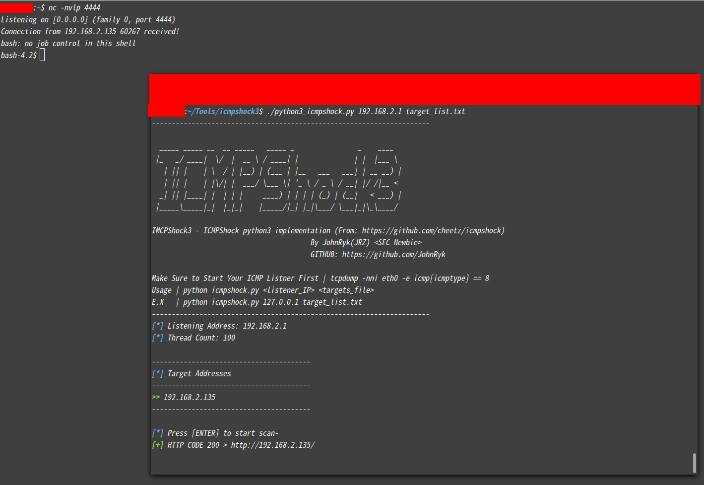

```
----------------------------------------------------------------------

  _____ _____ __  __ _____   _____ _                _    ____  
 |_   _/ ____|  \/  |  __ \ / ____| |              | |  |___ \ 
   | || |    | \  / | |__) | (___ | |__   ___   ___| | __ __) |
   | || |    | |\/| |  ___/ \___ \| '_ \ / _ \ / __| |/ /|__ < 
  _| || |____| |  | | |     ____) | | | | (_) | (__|   < ___) |
 |_____\_____|_|  |_|_|    |_____/|_| |_|\___/ \___|_|\_\____/ 
                                                               
IMCPShock3 - ICMPShock python3 implementation (From: https://github.com/cheetz/icmpshock)
                                        By JohnRyk(JRZ) <SEC Newbie>
                                        GITHUB: https://github.com/JohnRyk

Make Sure to Start Your ICMP Listner First | tcpdump -nni eth0 -e icmp[icmptype] == 8
Usage | python icmpshock.py <listener_IP> <targets_file>
E.X   | python icmpshock.py 127.0.0.1 target_list.txt
----------------------------------------------------------------------
```


## < About >


ICMPShock is a tool designed to determine whether or not a target web server contains cgi scripts
that could provide an attack vector for exploitation of the "ShellShock" bash vulnerability.

This is determined by injecting crafted environment variables into various fields 
of a POST request to 1 or more target web servers defined in a file. The value of these environment
variables is a "ping" command to the listening IP address the user specifies.

By using a tool such as tcpdump to listen for ICMP requests, the user can determine whether or not 
a target server is vulnerable by observing whether or not an ICMP request was sent from the target
to the listening machine the user specifies. If the user recieves an ICMP packet from the target, they can assume 
that the current version of the bash interpreter installed on the target is vulnerable.


## < Usage >


### ICMPShock

Before execution of this script, a tool such as tcpdump will need to be started to see results from the target.
An example of this would be-

```shell
sudo tcpdump -nni eth0 -e icmp[icmptype] == 8
```

After this is executed, the user will be ready to use ICMPShock.

The format to use this tool is-

```
python icmpshock.py <listening IP> <targets_file>
```

The user will be prompted to start the scanner, and the value of the listening IP and number of threads
will be reflected in STDOUT before the script is executed.

The targets file holds the target addresses, one line per target address-

============
target1
target2
target3

...snip...

The file "Updated_list_Cgi_files.txt" is the file which holds paths to CGI scripts to append to the address
of the web server. These values are from RAFT and detectify.com, but a different file can be used if specified in the 
code of the script (just uncomment the line #cgi_file = sys.argv[3], and uncomment the "for" loop at the bottom
of the script that uses "cgi_file" instead of "Updated_list_Cgi_files.txt"). If using sys.argv[3], then the command would look like-

```
python icmpshock.py <listening IP> <targets_file> <cgi_path_file>
```

An example-

```
python icmpshock.py 127.0.0.1 target_list.txt cgi_test_paths.txt
```


### ICMPShock3


​	The ICMPShock3 is from ICMPShock. So it almostly compatible with all the ICMPShock usage. Don't worry.


For Example:

​	To perform an "icmp" shellshock testing against `192.168.2.135`:


```shell
sudo tcpdump -nni eth0 -e icmp[icmptype] == 8

# Add target to the target list
echo '192.168.2.135' > target_list.txt

# Run ICMPShock3
./python3_icmpshock.py 192.168.2.1 target_list.txt
```


It works ! Now lets get a shell by exploit the shellshock:


```shell
# Set up listener
nc -nvlp 4444

# Execute the ICMPShock3
./python3_icmpshock.py 192.168.2.1 target_list.txt 
```




​	Great


